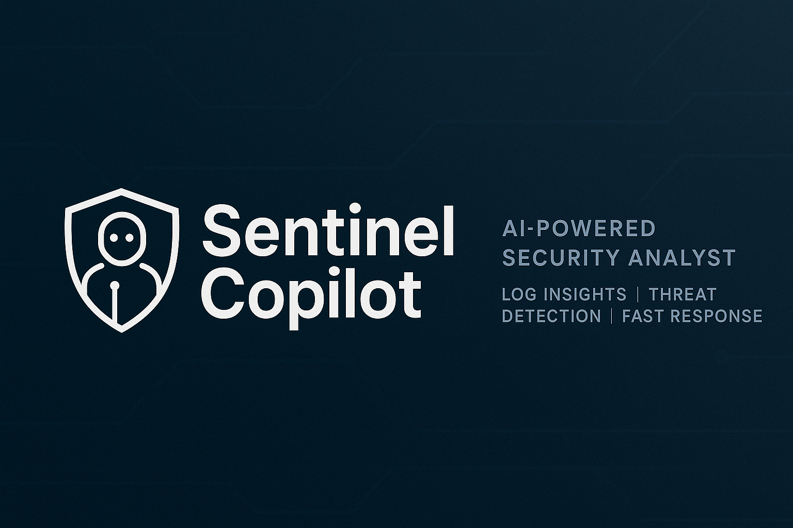

# Sentinel Copilot

> **Instant security insights from log files—no cloud keys or data science degree required. Upload, analyze, and export in seconds.**

**Try it live:** [sentinel-copilot.streamlit.app](https://sentinel-copilot.streamlit.app/)

---

## Table of Contents

- [Quick Start](#quick-start)
- [What Makes Sentinel Copilot Different?](#what-makes-sentinel-copilot-different)
- [Features at a Glance](#features-at-a-glance)
- [Architecture Overview](#architecture-overview)
- [AI & Anomaly Detection](#ai--anomaly-detection)
- [Sample Data](#sample-data)
- [Screenshots](#screenshots)
- [What’s Next?](#whats-next)
- [Requirements](#requirements)
- [Troubleshooting](#troubleshooting)
- [How to Extend](#how-to-extend)
- [Credits & Inspiration](#credits--inspiration)
- [Contributing](#contributing)
- [Connect & Contact](#connect--contact)
- [Built With](#built-with)
- [License](#license)

---

## Why This Project?

I’m a security analyst who got tired of endless scrolling through log files and “enterprise” dashboards that required more time to set up than to use.

**Sentinel Copilot** is my answer: a clean, practical tool that anyone on the team can use—engineers, analysts, even managers.

- **Built for humans:** Just upload your logs, get instant summaries, charts, and catch outliers with machine learning.
- **No gatekeeping:** All code is modular, documented, and built for learning or extension.
- **Coachability:** I’m always open to feedback—what you see here is the result of real iteration, testing, and learning from peers.

_If you value teamwork, honest feedback, and building for real-world use, I’d love to connect._


---

---

## Quick Start

1. **Clone the repository**
    ```bash
    git clone https://github.com/tesherakimbrough/sentinel-copilot.git
    cd sentinel-copilot
    ```
2. **Install dependencies**
    ```bash
    pip install -r requirements.txt
    ```
    > If you want to use machine learning features, scikit-learn is required and already included in requirements.txt.
3. **Run the app**
    ```bash
    streamlit run app/main.py
    ```
Or use the [live Streamlit demo](https://sentinel-copilot.streamlit.app/).

---

## Features at a Glance

- 🌙/☀️ **Dark/Light Mode Toggle**
- 🔍 **Instant filtering, sorting, and search**
- 📊 **Real-time charts for event & IP frequency**
- 🧠 **Built-in anomaly detection (Isolation Forest, no cloud required)**
- 📥 **Export filtered data and summaries (CSV)**
- ⚡ **Mobile-friendly & accessible**
- 📝 **Downloadable reports and summaries**
- 🧩 **Easy to extend for new log formats or AI analysis**

---

## What Makes Sentinel Copilot Different?

- **No vendor lock-in, no cloud keys:** Everything runs locally (or in your cloud, if you want).
- **Real ML, not just “AI-washing”:** Outlier detection actually works, even on small or messy log files.
- **Recruiter-friendly code:** Everything’s in plain Python; modular, commented, and easy to read.
- **User-first UI:** Built with non-engineers and speed in mind. If you can drag and drop, you can use it.

---

## Screenshots

 <!-- Replace with your actual screenshot filename -->

---

## Architecture Overview

```text
User Uploads Log File
       ↓
Log Parser (Python/pandas)
       ↓
AI Summary (mock/table, ready for OpenAI integration)
      ├── Visualizations (matplotlib/Streamlit)
      └── Downloadable Report
```

## Sample Data

You can test Sentinel Copilot right away with the provided `sample_logs/example_log.csv`.

Preview:

| timestamp           | source_ip    | event_type    |
|---------------------|-------------|---------------|
| 2025-06-01T12:00:00Z| 192.168.1.1 | login_success |
| 2025-06-01T12:05:00Z| 10.0.0.5    | login_failure |
| 2025-06-01T13:15:00Z| 10.0.0.5    | login_failure |
| 2025-06-01T14:00:00Z| 192.168.1.1 | login_success |


<details>
<summary>Click to view raw CSV</summary>

```
timestamp,source_ip,event_type
2025-06-01T12:00:00Z,192.168.1.1,login_success
2025-06-01T12:05:00Z,10.0.0.5,login_failure
2025-06-01T13:15:00Z,10.0.0.5,login_failure
2025-06-01T14:00:00Z,192.168.1.1,login_success
```
</details>

---

## What’s Next?

- Plug in OpenAI for true LLM-based summaries
- Support for more log formats (JSON, syslog, etc.)
- User authentication for team use

---

## Requirements

- Python 3.10+
- Works on Windows, macOS, or Linux

---

## Troubleshooting

- **Streamlit not found:**  
  Make sure you installed all requirements:  
  `pip install -r requirements.txt`

- **Port already in use:**  
  If you get an error about a port conflict, stop other Streamlit apps or change the port with:  
  `streamlit run app/main.py --server.port 8502`

- **Issues with plots or CSV files:**  
  Double-check your CSV format matches the sample. Supported columns: `timestamp`, `source_ip`, `event_type`.

---

## Credits & Inspiration

Inspired by open-source tools like Graylog, Splunk, and awesome projects from the Streamlit and InfoSec communities.

---

## How to Extend

Sentinel Copilot is built to be developer-friendly and easy to expand. Here’s how you (or your future teammates!) can make it even more powerful:

**Add a New Analysis or Visualization**
- Create a new Python file in `app/` (for example, `threat_intel.py`).
- Import and call your function from `main.py` or a sidebar menu.
- Use Streamlit widgets for new filters, uploaders, or interactive visualizations.

**Example:**

```python
# app/threat_intel.py
import streamlit as st

def show_threat_intel():
    st.subheader("Threat Intelligence Lookup")
    ip = st.text_input("Enter IP address to check:")
    if ip:
        st.info(f"Demo: Would check threat intel feeds for {ip}.")


#Add to main.py : 
from app.threat_intel import show_threat_intel
show_threat_intel()

```
## Plug in OpenAI or LLMs
- Install the openai Python package (pip install openai).

- Store your OpenAI API key in an environment variable or Streamlit secrets.

- Add an “AI Summary” or “Ask Copilot” button in your UI.

- Send log data (anonymized if needed) to the LLM and display results.

**Example:**

```python
import openai

openai.api_key = st.secrets["OPENAI_API_KEY"]
def generate_summary(logs):
    prompt = f"Summarize these security logs:\n{logs}"
    response = openai.ChatCompletion.create(
        model="gpt-3.5-turbo",
        messages=[{"role": "user", "content": prompt}]
    )
    return response.choices[0].message["content"]

if st.button("Get AI Summary"):
    summary = generate_summary(log_df.head(100).to_csv(index=False))
    st.info(summary)
```
Note: Be sure not to send sensitive data to external APIs without approval.

---

## Support More Log Formats
- Add a new parser in app/log_parser.py for JSON, syslog, or any custom format.
- Update the upload widget to accept more file types.
- Update your DataFrame processing code to handle new schemas.

**Example:**

```python
import json

def parse_json_logs(file):
    data = json.load(file)
    # Convert to DataFrame as needed
    return pd.DataFrame(data)
```
Then, in your upload handler, check the file type and route to the appropriate parser.

---

## Enable User Authentication
- Use Streamlit's experimental authentication or integrate OAuth with libraries like Auth0 or streamlit-authenticator.
- Protect sensitive actions (uploads, settings, etc.) with login checks.
- Store user session data with st.session_state.

**Example with streamlit-authenticator**:

```python
import streamlit_authenticator as stauth

names = ["Jane Doe"]
usernames = ["jane"]
passwords = ["securepassword"]

authenticator = stauth.Authenticate(names, usernames, passwords, "myapp", "abcdef", cookie_expiry_days=1)
name, auth_status, username = authenticator.login("Login", "main")

if auth_status:
    st.success(f"Welcome, {name}!")
else:
    st.warning("Please log in to use the app.")
```

See the streamlit-authenticator docs for details.

---

## Credits & Inspiration
Inspired by open-source tools like Graylog, Splunk, and awesome projects from the Streamlit and InfoSec communities.

## Contributing

Pull requests, feedback, and suggestions are always welcome!

---

## Connect & Contact

Want to chat, collaborate, or just see what else I’m working on?

[LinkedIn](https://www.linkedin.com/in/tesherakimbrough) | [GitHub](https://github.com/tesherakimbrough)

---

## Built With

- [Python](https://python.org)
- [Pandas](https://pandas.pydata.org/)
- [Streamlit](https://streamlit.io/)
- [Matplotlib](https://matplotlib.org/)
- [scikit-learn](https://scikit-learn.org/) (for machine learning anomaly detection)

---

## License
MIT

Sentinel Copilot is released under the MIT License.
You can use, modify, and distribute this project freely. Attribution is appreciated but not required.

---